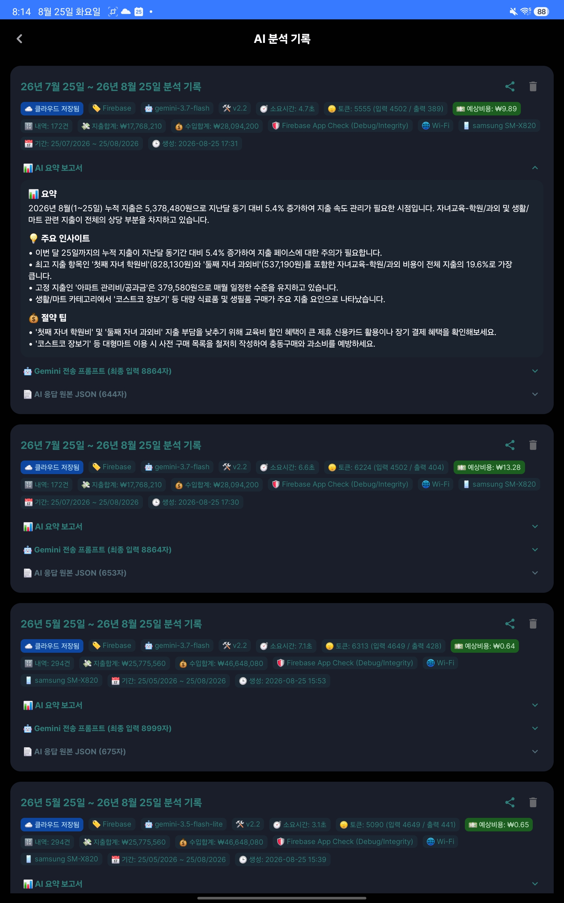
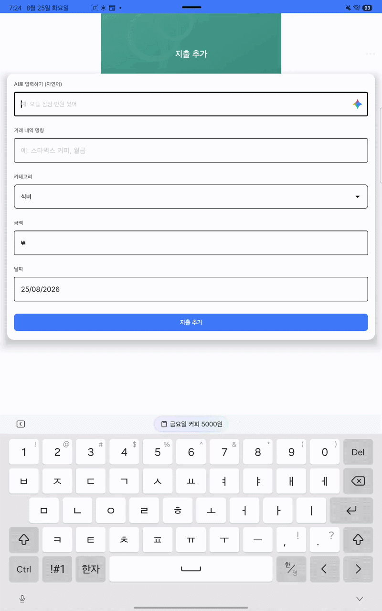
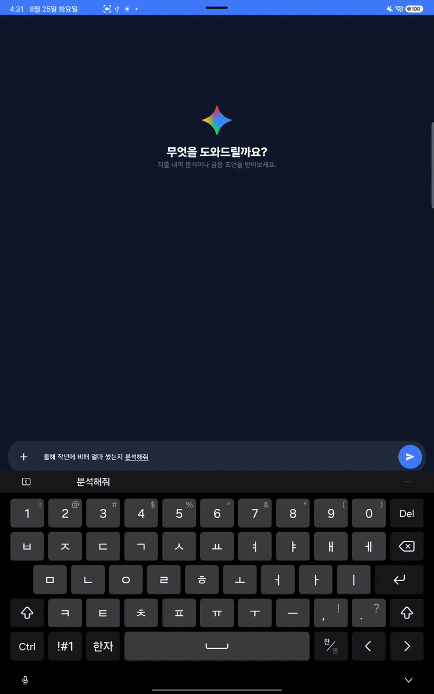

# Smart Spend AI

AI와 대화하며 지출을 기록하고, 내 소비를 이해할 수 있는 Android 가계부 앱입니다.

Smart Spend AI는 단순히 거래 내역을 저장하는 가계부에서 출발해, 사용자의 자연어 입력을 실제 가계부 데이터로 연결하는 AI 파이프라인을 구축하는 것을 목표로 합니다. 사용자는 직접 입력하거나 챗봇에게 질문할 수 있고, AI는 저장된 수입·지출 내역을 바탕으로 조회, 분석, 기록 관리, 절약 인사이트를 제공합니다.

## 주요 기능

### 가계부

- 수입 및 지출 기록 추가
- 거래 내역 조회, 상세 보기, 수정, 삭제
- 카테고리별 거래 관리
- 전체 잔액, 수입, 지출 및 최근 거래 확인
- 월별 지출 통계와 차트
- Room Database를 이용한 로컬 데이터 저장

### AI 입력 및 분석

- 자연어로 수입·지출 기록 생성
  - 예: 오늘 점심으로 12,000원 썼어
- 자연어 질문을 통한 거래 내역 조회
  - 예: 지난달 카페에서 쓴 금액을 보여줘
- 기간 및 카테고리 기반 소비 분석
- 월별·카테고리별 소비 패턴 요약
- 주요 소비 항목과 절약 팁 제공
- 분석 결과 및 AI 분석 이력 저장

### AI 챗봇 에이전트

- 가계부 데이터를 컨텍스트로 사용하는 대화형 챗봇
- 대화 세션 및 메시지 이력 관리
- 스트리밍 응답 표시
- 이전 대화 내용을 참조하는 후속 질문 처리
- 거래 추가·수정·삭제 전 확인 UI 제공
- 조회 결과의 상세 거래 내역 표시
- 이미지 첨부를 고려한 챗봇 인터페이스

## AI 파이프라인

챗봇의 모든 요청을 단일 프롬프트로 처리하지 않고, 사용자의 의도를 먼저 분류한 뒤 필요한 데이터 처리 단계로 연결합니다.

~~~mermaid
flowchart TD
    A[사용자 자연어 입력] --> B[Master Router]
    B --> C{의도 분류}
    C -->|거래 조회| D[Room 거래 데이터 검색]
    C -->|소비 분석| E[기간·카테고리 데이터 집계]
    C -->|거래 변경| F[대상 거래 식별]
    C -->|일반 대화| G[일반 AI 응답]
    D --> H[Gemini 응답 생성]
    E --> H
    F --> I[사용자 확인]
    I --> J[Room 데이터 반영]
    G --> H
    H --> K[스트리밍 응답 및 이력 저장]
~~~

핵심 흐름은 다음과 같습니다.

1. Master Router가 요청을 DATA_RETRIEVAL, DATA_ANALYSIS, DATA_MANIPULATION, SIMPLE_RESPONSE 등으로 분류합니다.
2. 필요한 기간, 카테고리, 검색 대상, 연산 유형을 구조화합니다.
3. Room 데이터에서 관련 거래를 조회하거나 분석용 데이터로 요약합니다.
4. Gemini가 조회 결과 또는 요약된 소비 데이터를 바탕으로 답변을 생성합니다.
5. 거래 변경이 필요한 경우 대상과 변경 내용을 사용자에게 먼저 보여주고 확인을 받습니다.
6. 응답, 토큰 사용량, 응답 시간, 모델 정보 및 분석 결과를 로컬 또는 Firebase에 저장합니다.

## 앱 구조

~~~text
app/src/main/java/com/smartspend/ai/
├── ai/
│   ├── analysis/       # 소비 분석 화면 및 분석 이력
│   ├── chat_agent/     # AI 챗봇 UI와 대화 세션
│   ├── gateway/        # AiGateway와 Firebase AI Logic 구현체
│   └── model/          # AI 응답 모델
├── auth/               # Google/Firebase 로그인
├── data/
│   ├── dao/            # Expense, Chat, AI Analysis DAO
│   ├── model/          # Room Entity
│   └── repository/     # 로컬·클라우드 데이터 저장소
├── feature/
│   ├── add_expense/    # 수입·지출 추가
│   ├── home/           # 홈 화면
│   ├── transactionlist/ # 거래 내역
│   └── transaction_detail/
└── ui/theme/           # Compose 테마
~~~

## 기술 스택

- Kotlin
- Jetpack Compose
- Material 3
- Android Navigation Compose
- Room Database
- Dagger Hilt
- MVVM
- Firebase Authentication
- Firebase AI Logic / Gemini
- Cloud Firestore
- Firebase Storage
- Firebase App Check
- MPAndroidChart
- Markwon Markdown renderer

## 데이터 및 서비스 구성

~~~text
Android App
├── Room
│   ├── 수입·지출 내역
│   ├── 채팅 세션·메시지
│   └── AI 분석 이력
├── Firebase Authentication
│   └── 사용자 로그인
├── Firebase AI Logic
│   └── Gemini 기반 자연어 파싱·라우팅·분석·챗봇
├── Cloud Firestore
│   └── 사용자별 채팅 및 AI 분석 이력 동기화
└── Firebase Storage
    └── 챗봇 첨부 파일 저장
~~~

기본적으로 거래 데이터는 앱의 Room Database에서 관리됩니다. 로그인한 사용자의 채팅 및 AI 분석 이력은 Firebase와 동기화할 수 있으며, 분석 결과에는 사용 모델, 응답 시간, 토큰 사용량 등의 실행 메타데이터도 함께 기록됩니다.

## 시작하기

### 요구 사항

- Android Studio 최신 안정 버전 권장
- JDK 8 이상
- Android SDK 34
- Android 7.0(API 24) 이상
- Firebase 프로젝트

### Firebase 설정

1. Firebase Console에서 Android 앱을 생성합니다.
2. 패키지 이름을 com.smartspend.ai로 등록합니다.
3. Google 로그인, Authentication, Firestore, Storage, App Check를 필요한 환경에 맞게 활성화합니다.
4. Firebase AI Logic을 사용할 수 있도록 프로젝트를 설정합니다.
5. Firebase Console에서 받은 google-services.json을 app/ 디렉터리에 둡니다.

google-services.json은 개인 프로젝트 설정과 인증 정보가 포함될 수 있으므로 공개 저장소에 올릴 때는 포함 여부를 확인하세요.

### 빌드 및 실행

~~~bash
git clone https://github.com/b6star/Smart-Spend-AI.git
cd Smart-Spend-AI
~~~

Android Studio에서 프로젝트를 연 후 Gradle Sync를 실행하고 에뮬레이터 또는 실제 Android 기기에서 app을 실행합니다.

명령줄 빌드는 다음과 같이 실행할 수 있습니다.

~~~bash
./gradlew assembleDebug
~~~

Windows에서는 다음을 사용합니다.

~~~powershell
.\gradlew.bat assembleDebug
~~~

## 스크린샷

| AI 분석  | 지출 추가 | AI 챗봇 |
|----------------------------------------------------| ------------------------------------------------- |-------------------------------------------------|
|  |  |  |

## 프로젝트 상태

현재 개발 중인 프로젝트입니다. 가계부의 기본 기능과 Firebase 기반 AI 챗봇·소비 분석 파이프라인을 함께 개발하고 있습니다. 프롬프트, 모델 설정, 분석 결과 형식 및 Firebase 연동 방식은 개발 과정에서 변경될 수 있습니다.

## 출처

기본 가계부 기능과 초기 프로젝트 구조는 [CodeWithFK의 Expense Tracker 프로젝트](https://github.com/furqanullah717/expense-tracker-android)를 바탕으로 확장했습니다.

- 원본 저장소: [furqanullah717/expense-tracker-android](https://github.com/furqanullah717/expense-tracker-android)
- 원본 튜토리얼: [CodeWithFK YouTube](https://www.youtube.com/@codewithfk)
